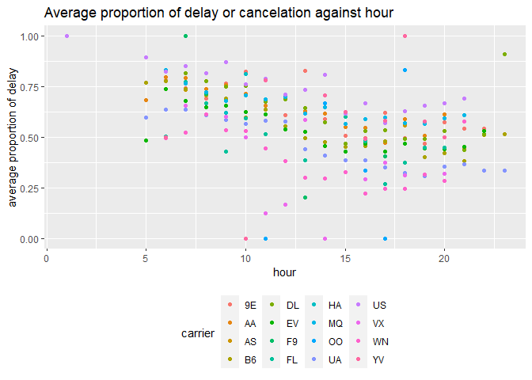

HW2
================
Yaling Hong
2022/10/10

My Github:
<https://github.com/YalinghHong/myrepo/myrepo/blob/main/HW2.md>

# Data Preprocessing

``` r
library(nycflights13)
```

    ## Warning: 程辑包'nycflights13'是用R版本4.1.3 来建造的

``` r
library(dplyr)
```

    ## 
    ## 载入程辑包：'dplyr'

    ## The following objects are masked from 'package:stats':
    ## 
    ##     filter, lag

    ## The following objects are masked from 'package:base':
    ## 
    ##     intersect, setdiff, setequal, union

``` r
library(ggplot2)
```

Here we focus on departure delays where missing values are determined as
cancelations. Also, we only consider the time of hour of the day while
ignoring the minutes.

Add a column called delay, this is a column of logical values to
determin whether the flights is delayed/canceld or not.

``` r
flight=flights%>%
  mutate(delay=if_else(dep_delay<0|is.na(dep_delay),true=T,false=F))%>%
  select(delay,carrier,origin,time_hour)
```

Use the two variables, visibility and precipitation, to depict what is
the weather like. Join these two data sets flights and weather by origin
and time_hour.

``` r
weather=weather%>%select(time_hour,origin,month,hour,precip,visib)
data=inner_join(flight,weather)
```

    ## Joining, by = c("origin", "time_hour")

Add a column called season labeled as factors.

``` r
data$season=cut(data$month,breaks=c(0,2,5,8,11,12),
                labels=c("winter","spring","summer","fall","winter"))
```

Gain three sub data sets, each is grouped by hour and season, origin,
carrier separately. Using the mean of visibility and precipitation to
determine the weather. Calculate average delay as the proportion of
delayed flights.

``` r
subdata1=data%>%
  group_by(season,hour)%>%
  summarise(avg_delay=sum(delay)/n(),
            visib=mean(visib),precip=mean(precip))
```

    ## `summarise()` has grouped output by 'season'. You can override using the
    ## `.groups` argument.

``` r
subdata2=data%>%
  group_by(origin,hour)%>%
  summarise(avg_delay=sum(delay)/n(),
            visib=mean(visib),precip=mean(precip))
```

    ## `summarise()` has grouped output by 'origin'. You can override using the
    ## `.groups` argument.

``` r
subdata3=data%>%
  group_by(carrier,hour)%>%
  summarise(avg_delay=sum(delay)/n(),
            visib=mean(visib),precip=mean(precip))
```

    ## `summarise()` has grouped output by 'carrier'. You can override using the
    ## `.groups` argument.

# Introduction

The delay or cancelation of the flights is associated with many factors,
including time, season, weather, airport, airline and so on. According
to the data analysis, 15 to 20 is the best time period of a day to avoid
flight delay. Although season, weather, airport and airline might have a
slight impact on the delay, the result still holds generally. Season is
strongly associated with weather, we can find that generally possesses
the highest visibility and the lowest precipitation, so the proportions
of delay of different departure hours are generally less than those of
other seasons. However, the lines of the average proportion of delay
against hour of different seasons are nearly parallel. Therefore,
seasons may have an influence on the total delay proportion, but it
won’t affect our choices of the time of the day to avoid delays. The
same goes for the airports. Although LGA seems to have a higher delay
proportion than other two airports, 15 to 20 is also the best period to
avoid the delay for all three airports. Despite some outliers, this
conclusion also holds for different airlines. Except for airline VX, it
is better to choose a flight between 11 and 15 with airline VX.

# Season and weather

``` r
ggplot(subdata1,aes(x=hour,y=avg_delay,size=visib,color=precip))+
  geom_point()+
  ylab("average proportion of delay")+
  facet_wrap(~season)+
  ggtitle("Average proportion of delay or cancelation against hour")
```

<!-- -->

From the plot above we can figure out that there is a strong
relationship between seasons and visibility, precipitation. Especially,
summer tends to have the highest visibility and the lowest
precipitation, which may result in its low delay proportion.
Precipitation seems not to have such a strong effect on delay compared
to visibility. Usually the higher the visibility the lower the delay
proportion. It is also easy to tell that the four lines of delay
proportion against hour of different seasons are almost paralleled,
meaning that season doesn’t have a significant impact on our choices of
time of the day if we want to avoid delays.

# Airport

``` r
ggplot(subdata2,aes(x=hour,y=avg_delay))+
  geom_point()+
  ylab("average proportion of delay")+
  facet_wrap(~origin)+
  ggtitle("Average proportion of delay or cancelation against hour")
```

<!-- -->

The point of proportion equals to 1 with hour equals to 1 and airport of
EWR is because it only contains a single flight which is delayed. The
three airport seem to have the same pattern of delay proportion against
time, though there is a slight difference of general delay proportion
against different airports. Specifically, the delay proportion of LGA is
higher than those of the other two airports. In general, 15 to 20 is
still the best time choice of the day regardless of the departure
airports.

# Airlines

``` r
ggplot(subdata3,aes(x=hour,y=avg_delay,color=carrier))+
  geom_point()+
  ylab("average proportion of delay")+
  ggtitle("Average proportion of delay or cancelation against hour")+
  theme(legend.position="bottom")
```

<!-- -->

There are several points whose delay proportion equals to one or zero.
This is because that there are few flights on that specific hour carried
by certain airlines. It is easy to tell that US seems to perform worst
while WN seems to perform best. However, during the time period of 15 to
20, they all tend to have the lowest delay proportion within the same
airline. Except for the airline VX, whose delay proportion reaches the
lowest from 11 to 15.

# Conclusion

In short, those factors such as season, weather, airport and airline
tend to have some impacts on the delay proportion or on each other, they
don’t seem to be associated with the time of the day. Below is a box
plot of delay proportion against different hours. It is reasonable to
choose a flight from 15 to 20 if we want to avoid delay as much as
possible.

``` r
subdata1$hour=as.factor(subdata1$hour)
ggplot(subdata1)+geom_boxplot(aes(x=hour,y=avg_delay))
```

<!-- -->
