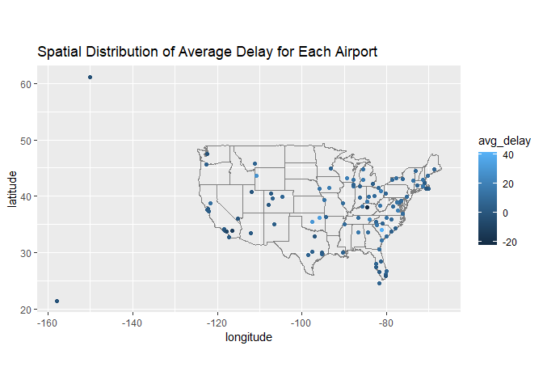
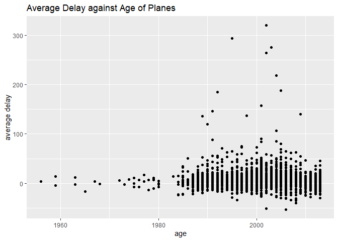

HW3
================
Yaling Hong
2022/10/18

``` r
library(dplyr)
## Warning: 程辑包'dplyr'是用R版本4.1.3 来建造的
## 
## 载入程辑包：'dplyr'
## The following objects are masked from 'package:stats':
## 
##     filter, lag
## The following objects are masked from 'package:base':
## 
##     intersect, setdiff, setequal, union
library(ggplot2)
library(nycflights13)
## Warning: 程辑包'nycflights13'是用R版本4.1.3 来建造的
library(maps)
## Warning: 程辑包'maps'是用R版本4.1.3 来建造的
```

1

``` r
flights%>%
  group_by(dest)%>%
  summarise(avg_delay=mean(arr_delay,na.rm=T))%>%
  left_join(airports%>%select(faa,lat,lon),by=c("dest"="faa"))%>%
  ggplot(aes(lon,lat))+
  borders("state")+
  geom_point(aes(color=avg_delay))+
  xlab("longitude")+
  ylab("latitude")+
  ggtitle("Spatial Distribution of Average Delay for Each Airport")+
  coord_quickmap()
```

    ## Warning: Removed 4 rows containing missing values (geom_point).

<!-- -->

2

``` r
flights%>%
  left_join(airports%>%select(faa,lat,lon),by=c("origin"="faa"))%>%
  left_join(airports%>%select(faa,lat,lon),by=c("dest"="faa"),
            suffix=c("_origin","_dest"))
```

    ## # A tibble: 336,776 x 23
    ##     year month   day dep_time sched_dep_time dep_delay arr_time sched_arr_time
    ##    <int> <int> <int>    <int>          <int>     <dbl>    <int>          <int>
    ##  1  2013     1     1      517            515         2      830            819
    ##  2  2013     1     1      533            529         4      850            830
    ##  3  2013     1     1      542            540         2      923            850
    ##  4  2013     1     1      544            545        -1     1004           1022
    ##  5  2013     1     1      554            600        -6      812            837
    ##  6  2013     1     1      554            558        -4      740            728
    ##  7  2013     1     1      555            600        -5      913            854
    ##  8  2013     1     1      557            600        -3      709            723
    ##  9  2013     1     1      557            600        -3      838            846
    ## 10  2013     1     1      558            600        -2      753            745
    ## # ... with 336,766 more rows, and 15 more variables: arr_delay <dbl>,
    ## #   carrier <chr>, flight <int>, tailnum <chr>, origin <chr>, dest <chr>,
    ## #   air_time <dbl>, distance <dbl>, hour <dbl>, minute <dbl>, time_hour <dttm>,
    ## #   lat_origin <dbl>, lon_origin <dbl>, lat_dest <dbl>, lon_dest <dbl>

3

It is hard to conclude that there is a relationship between the age of
the planes and delays. The confidential religion of those manufactured
very ealy is very large because the number of the samples is little.
Although some new planes tend to have higher delays, they also provide
more flights. We cannot tell whether the carrier assign more flights to
them because they are young.

``` r
flights%>%
  group_by(tailnum)%>%
  summarise(avg_delay=mean(arr_delay,na.rm=T))%>%
  left_join(planes%>%select(tailnum,year),by="tailnum")%>%
  ggplot(aes(x=year,y=avg_delay))+
  geom_smooth()
```

    ## `geom_smooth()` using method = 'gam' and formula 'y ~ s(x, bs = "cs")'

    ## Warning: Removed 798 rows containing non-finite values (stat_smooth).

<!-- -->
