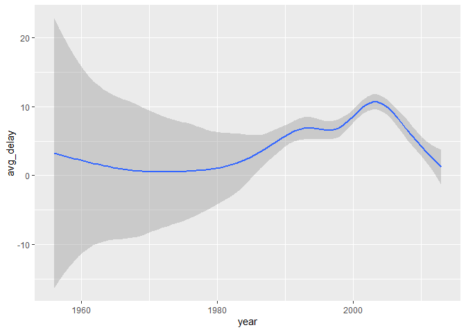

HW3
================
Yaling Hong
2022/10/17

``` r
library(dplyr)
## Warning: 程辑包'dplyr'是用R版本4.1.3 来建造的
## 
## 载入程辑包：'dplyr'
## The following objects are masked from 'package:stats':
## 
##     filter, lag
## The following objects are masked from 'package:base':
## 
##     intersect, setdiff, setequal, union
library(nycflights13)
## Warning: 程辑包'nycflights13'是用R版本4.1.3 来建造的
library(ggplot2)
library(maps)
## Warning: 程辑包'maps'是用R版本4.1.3 来建造的
library(tidyr)
## Warning: 程辑包'tidyr'是用R版本4.1.3 来建造的
```

1

``` r
avg_delay=flights%>%
  group_by(dest)%>%
  summarise(avg_delay=mean(arr_delay,na.rm=T))
avg_delay=avg_delay[complete.cases(avg_delay),]
airport=airports%>%
  select(faa,lat,lon)
colnames(airport)=c("dest","lat","lon")
data=right_join(airport,avg_delay)
```

    ## Joining, by = "dest"

``` r
data=data[complete.cases(data),]
ggplot(data,aes(lon,lat))+
  borders("state")+
  geom_point(aes(colour=avg_delay))+
  coord_quickmap()+
  xlab("longitude")+
  ylab("latitude")+
  ggtitle("Spatial Distribution of Average Delay for Each Airport")
```

<!-- -->

2

``` r
colnames(airport)=c("origin","lat","lon")
org=flights%>%
  left_join(airport,by="origin")
org_names=colnames(org)
org_names[length(org_names)]="origin_lon"
org_names[length(org_names)-1]="origin_lat"
colnames(org)=org_names
colnames(airport)[1]="dest"
dest=flights%>%
  select(dest)%>%
  left_join(airport,by="dest")
dest_names=colnames(dest)
dest_names[3]="dest_lon"
dest_names[2]="dest_lat"
colnames(dest)=dest_names
dest_lon=dest$dest_lon
dest_lat=dest$dest_lat
flight=org%>%
  mutate(dest_lon=dest_lon,dest_lat=dest_lat)
head(flight)
```

    ## # A tibble: 6 x 23
    ##    year month   day dep_time sched_dep_time dep_delay arr_time sched_arr_time
    ##   <int> <int> <int>    <int>          <int>     <dbl>    <int>          <int>
    ## 1  2013     1     1      517            515         2      830            819
    ## 2  2013     1     1      533            529         4      850            830
    ## 3  2013     1     1      542            540         2      923            850
    ## 4  2013     1     1      544            545        -1     1004           1022
    ## 5  2013     1     1      554            600        -6      812            837
    ## 6  2013     1     1      554            558        -4      740            728
    ## # ... with 15 more variables: arr_delay <dbl>, carrier <chr>, flight <int>,
    ## #   tailnum <chr>, origin <chr>, dest <chr>, air_time <dbl>, distance <dbl>,
    ## #   hour <dbl>, minute <dbl>, time_hour <dttm>, origin_lat <dbl>,
    ## #   origin_lon <dbl>, dest_lon <dbl>, dest_lat <dbl>

3

From the plot below we cannot conclude that there is a relationship
between the age of the plane and delays. Although some new planes tend
to have higher delays, they also provide more flights. We cannot tell
whether the carrier assign more flights to them because they are young.

``` r
delay_tail=flights%>%
  group_by(tailnum)%>%
  summarise(avg_delay=mean(arr_delay,na.rm=T))
delay_tail=delay_tail[complete.cases(delay_tail),]
age=planes%>%
  select(tailnum,year)
df=left_join(delay_tail,age,by="tailnum")
df=df[complete.cases(df),]
ggplot(df,aes(year,avg_delay))+
  geom_point()+
  xlab("age")+
  ylab("average delay")+
  ggtitle("Average Delay against Age of Planes")
```

<!-- -->
