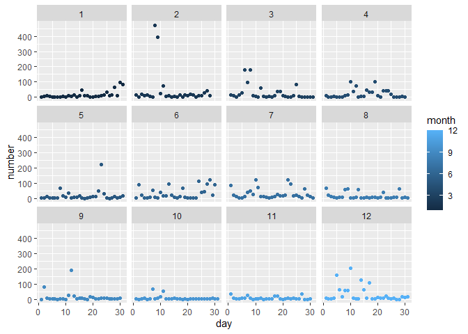
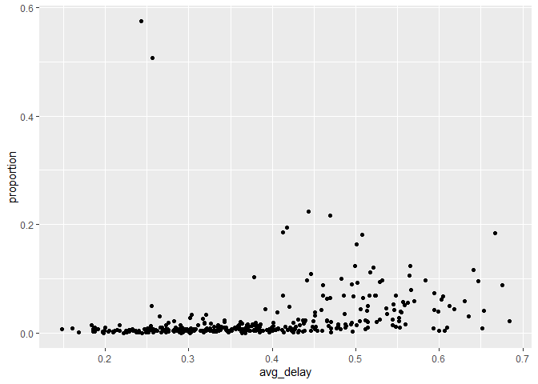

Homework1
================
Yaling Hong
2022/9/22

My Github: <https://github.com/YalinghHong/myrepo/blob/main/Homework.md>

``` r
library(nycflights13)
library(dplyr)
```

    ## 
    ## 载入程辑包：'dplyr'

    ## The following objects are masked from 'package:stats':
    ## 
    ##     filter, lag

    ## The following objects are masked from 'package:base':
    ## 
    ##     intersect, setdiff, setequal, union

``` r
library(ggplot2)
```

1

How many flights have a missing dep_time?

8255

``` r
flights%>%
  filter(is.na(dep_time))%>%
  summarise(n())
```

    ## # A tibble: 1 x 1
    ##   `n()`
    ##   <int>
    ## 1  8255

What other variables are missing?

dep_delay, arr_time, arr_delay, tailnum and air_time

``` r
f<-function(x){
  return(if_else(T%in%is.na(x),true=T,false=F))
}
v<-flights%>%
  filter(is.na(dep_time))%>%
  apply(2,f)
names(which(v==T))
```

    ## [1] "dep_time"  "dep_delay" "arr_time"  "arr_delay" "tailnum"   "air_time"

What might these rows represent?

Maybe these flights are canceled so the departure time is not recorded.

2

Currently dep_time and sched_dep_time are convenient to look at, but
hard to compute with because they’re not really continuous numbers.
Convert them to a more convenient representation of number of minutes
since midnight.

``` r
flights%>%
  mutate(dep_time_in_minute=60*(dep_time%/%100)+dep_time%%100,
         sched_dep_time_in_minute=60*(sched_dep_time%/%100)+sched_dep_time%%100)
```

    ## # A tibble: 336,776 x 21
    ##     year month   day dep_time sched_dep_time dep_delay arr_time sched_arr_time
    ##    <int> <int> <int>    <int>          <int>     <dbl>    <int>          <int>
    ##  1  2013     1     1      517            515         2      830            819
    ##  2  2013     1     1      533            529         4      850            830
    ##  3  2013     1     1      542            540         2      923            850
    ##  4  2013     1     1      544            545        -1     1004           1022
    ##  5  2013     1     1      554            600        -6      812            837
    ##  6  2013     1     1      554            558        -4      740            728
    ##  7  2013     1     1      555            600        -5      913            854
    ##  8  2013     1     1      557            600        -3      709            723
    ##  9  2013     1     1      557            600        -3      838            846
    ## 10  2013     1     1      558            600        -2      753            745
    ## # ... with 336,766 more rows, and 13 more variables: arr_delay <dbl>,
    ## #   carrier <chr>, flight <int>, tailnum <chr>, origin <chr>, dest <chr>,
    ## #   air_time <dbl>, distance <dbl>, hour <dbl>, minute <dbl>, time_hour <dttm>,
    ## #   dep_time_in_minute <dbl>, sched_dep_time_in_minute <dbl>

# 3

Look at the number of canceled flights per day. Is there a pattern?

First, we can take a quick glance of the data. The result below shows
that all missing values in dep_delay is caused by cancellation.

``` r
flights%>%
  select(dep_time,dep_delay)%>%
  filter(is.na(dep_time))%>%
  summary()
```

    ##     dep_time      dep_delay   
    ##  Min.   : NA    Min.   : NA   
    ##  1st Qu.: NA    1st Qu.: NA   
    ##  Median : NA    Median : NA   
    ##  Mean   :NaN    Mean   :NaN   
    ##  3rd Qu.: NA    3rd Qu.: NA   
    ##  Max.   : NA    Max.   : NA   
    ##  NA's   :8255   NA's   :8255

``` r
df<-flights%>%
  mutate(status=is.na(dep_time))%>%
  group_by(month,day)%>%
  summarise(number=sum(status),
            proportion=sum(status)/n(),
            avg_delay=sum(dep_delay>0,na.rm=T)/n())
```

    ## `summarise()` has grouped output by 'month'. You can override using the
    ## `.groups` argument.

``` r
df  
```

    ## # A tibble: 365 x 5
    ## # Groups:   month [12]
    ##    month   day number proportion avg_delay
    ##    <int> <int>  <int>      <dbl>     <dbl>
    ##  1     1     1      4    0.00475     0.418
    ##  2     1     2      8    0.00848     0.477
    ##  3     1     3     10    0.0109      0.452
    ##  4     1     4      6    0.00656     0.427
    ##  5     1     5      3    0.00417     0.372
    ##  6     1     6      1    0.00120     0.425
    ##  7     1     7      3    0.00322     0.317
    ##  8     1     8      4    0.00445     0.271
    ##  9     1     9      5    0.00554     0.228
    ## 10     1    10      3    0.00322     0.205
    ## # ... with 355 more rows

From the plot below we know that there isn’t a pattern of the numbers of
canceled flights per day.

``` r
ggplot(df,aes(x=day,y=number))+geom_point(aes(color=month))+facet_wrap(~month)
```

<!-- -->

Is the proportion of canceled flights related to the average delay?

Yes.When the average delay is less than 0.4, the proportion is very
close to 0 despite several outliers. As the average delay increases,
proportion of cancellation seems to increase as well.

``` r
ggplot(df,aes(x=avg_delay,y=proportion))+geom_point()
```

<!-- -->
